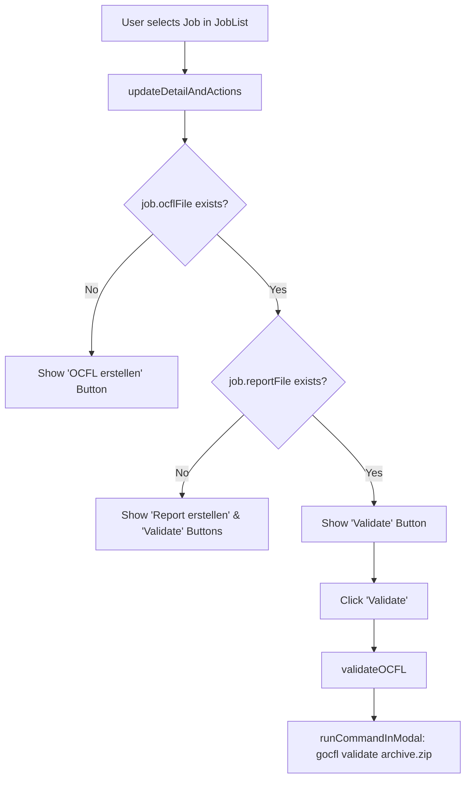

# Requirements

### Overview & Goals
When an OCFL ZIP archive exists for a selected job (`job.ocflFile != ""`), the application should always provide a "Validate" button in the action panel. Clicking this button executes `gocfl validate <path-to-ocfl-zip>` inside the real-time execution modal.

### Scope
- **In Scope**:
  - Add `validateOCFL` action in `cmd/create_container/actions.go` executing `gocfl validate <zip-path>`.
  - Update `updateDetailAndActions` in `cmd/create_container/ui.go` to always include the "Validate" button when `job.ocflFile != ""`.
  - Handle layout and keyboard focus navigation when both "Report erstellen" and "Validate" buttons are present.
- **Out of Scope**:
  - Modifying `gocfl` CLI binary or validation logic itself.
  - Changing batch or signature discovery logic in `job.go`.

### Functional Requirements
- **FR-1**: When a job without an OCFL archive is selected (`job.ocflFile == ""`), the UI continues to show "OCFL erstellen".
- **FR-2**: When a job with an OCFL archive is selected (`job.ocflFile != ""`), the UI must show the "Validate" button.
  - If the PDF report does not exist yet (`job.reportFile == ""`), both "Report erstellen" and "Validate" buttons are displayed.
  - If the PDF report already exists (`job.reportFile != ""`), the "Validate" button is displayed.
- **FR-3**: Selecting/activating "Validate" invokes `gocfl validate <path-to-ocfl-zip>` streaming stdout/stderr inside the modal dialog (`runCommandInModal`).
- **FR-4**: Closing the modal via ESC/Enter refreshes the job/batch state and refocuses the job list.

# Technical Design

### Current Implementation
In `cmd/create_container/ui.go`, `updateDetailAndActions` currently displays:
- "OCFL erstellen" if `job.ocflFile == ""`
- "Report erstellen" if `job.ocflFile != ""` and `job.reportFile == ""`
- No button if both `job.ocflFile` and `job.reportFile` exist.

Execution of commands is handled via `runCommandInModal` in `cmd/create_container/actions.go` (`createOCFL` and `createReport`).

### Proposed Changes

#### 1. `cmd/create_container/actions.go`
Introduce `validateOCFL`:
```go
// validateOCFL displays a modal execution dialog and runs the background process
// to validate the OCFL container for the selected job, streaming process output in real-time.
func validateOCFL(app *tview.Application, pages *tview.Pages, conf *WBConfig, logger zerolog.Logger, job Job, onFinish func()) {
	zipName := fmt.Sprintf("%s.zip", job.baseName)
	cmd := exec.Command("gocfl",
		"validate",
		filepath.Join(conf.Ocfl, zipName),
	)

	title := fmt.Sprintf(" OCFL Validierung: %s ", job.signature)
	startMsg := fmt.Sprintf("[yellow]Starte OCFL-Validierung für %s...[white]", job.signature)

	runCommandInModal(app, pages, title, startMsg, cmd, onFinish)
}
```

#### 2. `cmd/create_container/ui.go`
- In `updateDetailAndActions(job Job)`:
  - If `job.ocflFile == ""`: add "OCFL erstellen" button.
  - If `job.ocflFile != ""`:
    - If `job.reportFile == ""`: add "Report erstellen" button.
    - Always add "Validate" button.
- Format `buttonFlex` to space and lay out buttons appropriately (centered with margins).
- Adjust `actionButtons []*tview.Button` / `buttonFlex.HasFocus()` helper so focus navigation (Tab/Shift-Tab/Right/Left) smoothly focuses the first available action button or checks focus within `detailFlex`.

### Architecture Diagram


# Testing

### Validation Approach
- **Build verification**: Verify project compiles cleanly with `go build ./...` and `go test ./...`.
- **UI State Verification**:
  - Jobs with no OCFL ZIP: Only "OCFL erstellen" is present.
  - Jobs with OCFL ZIP but no PDF report: Both "Report erstellen" and "Validate" are present.
  - Jobs with both OCFL ZIP and PDF report: "Validate" is present.
- **Action Execution**: Ensure clicking "Validate" spawns `gocfl validate <ocfl_zip_path>` within `runCommandInModal` and dismisses properly with Enter/Escape.

# Delivery Steps

### ✓ Step 1: Implement validateOCFL command execution in actions.go
Implement the validation command runner in `cmd/create_container/actions.go` that triggers `gocfl validate` on the job's OCFL archive.

- Add `validateOCFL(app *tview.Application, pages *tview.Pages, conf *WBConfig, logger zerolog.Logger, job Job, onFinish func())` to `actions.go`.
- Configure the execution command `gocfl validate <path_to_ocfl_zip>` using `filepath.Join(conf.Ocfl, fmt.Sprintf("%s.zip", job.baseName))`.
- Wrap execution in `runCommandInModal` with modal title ` OCFL Validierung: <signature> ` and informative start message.
- Ensure `onFinish` callback triggers UI refresh and returns focus upon modal dismissal.

### ✓ Step 2: Add Validate button and update UI layout and focus handling in ui.go
Update `cmd/create_container/ui.go` to always display the "Validate" button whenever the OCFL ZIP file exists, and adapt layout and focus navigation for multiple buttons.

- Update `updateDetailAndActions(job Job)` in `ui.go` so that whenever `job.ocflFile != ""` the "Validate" button is added.
- Support rendering both "Report erstellen" and "Validate" when `job.reportFile == ""` and `job.ocflFile != ""`, or "Validate" alone when `job.reportFile != ""`.
- Update `focusDetail` and `isDetailFocused` to work cleanly with single or multiple action buttons in `buttonFlex`.
- Verify compilation and UI navigation.