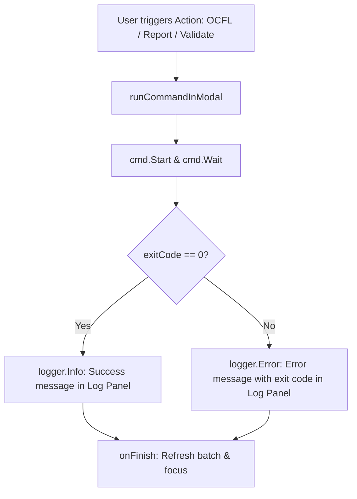

# Requirements

### Overview & Goals
Currently, `runCommandInModal` executes background CLI commands (`gocfl`) and streams their output into a modal text view, but discards the command's exit code (`_ = cmd.Wait()`) and does not report completion status to the application's log window. 

The goal of this change is to:
1. Capture the actual process exit code in `runCommandInModal` and supply it to the `onFinish` callback.
2. Emit an informative success message (`logger.Info()`) to the log window if the command exits with code `0`.
3. Emit an informative error message (`logger.Error()`) to the log window with the exit code if the command exits with a non-zero code or fails to start.

### Scope
- **In Scope**:
  - Updating `runCommandInModal` in `cmd/create_container/actions.go` to capture exit code from `cmd.Start()` / `cmd.Wait()`.
  - Updating `onFinish` signature of `runCommandInModal` to receive `exitCode int`.
  - Adding status logging (success and error messages) in `createOCFL`, `createReport`, and `validateOCFL` in `cmd/create_container/actions.go`.
  - Ensuring the application's bottom log window displays these messages in real-time.
- **Out of Scope**:
  - Modifying the external `gocfl` tool or its exit codes.
  - Modifying UI layouts in `ui.go`.

### Functional Requirements
- **FR-1**: When `runCommandInModal` finishes executing a command, it determines the exact exit code (e.g. `0` for success, exit code from `*exec.ExitError`, or non-zero fallback if process start failed).
- **FR-2**: For `createOCFL`:
  - On exit code `0`: log an info message to the log window (e.g., `OCFL-Erstellung für <signature> erfolgreich abgeschlossen`).
  - On exit code `!= 0`: log an error message to the log window (e.g., `Fehler bei der OCFL-Erstellung für <signature> (Exit-Code: <code>)`).
- **FR-3**: For `createReport`:
  - On exit code `0`: log an info message to the log window (e.g., `Report-Erstellung für <signature> erfolgreich abgeschlossen`).
  - On exit code `!= 0`: log an error message to the log window (e.g., `Fehler bei der Report-Erstellung für <signature> (Exit-Code: <code>)`).
- **FR-4**: For `validateOCFL`:
  - On exit code `0`: log an info message to the log window (e.g., `OCFL-Validierung für <signature> erfolgreich abgeschlossen`).
  - On exit code `!= 0`: log an error message to the log window (e.g., `Fehler bei der OCFL-Validierung für <signature> (Exit-Code: <code>)`).
- **FR-5**: Existing UI refresh behaviour (`onFinish` passed from `ui.go`) remains functional after modal dismissal.

# Technical Design

### Current Implementation
In `cmd/create_container/actions.go`:
- `runCommandInModal` starts `cmd.Start()`, streams lines from `io.MultiReader(stdout, stderr)` into `modalText`, and calls `_ = cmd.Wait()`.
- Its `onFinish` parameter has type `func()`, with no exit code passed.
- `createOCFL`, `createReport`, and `validateOCFL` pass `onFinish func()` straight to `runCommandInModal` without logging completion status into `logger`.

### Key Decisions
1. **Exit Code Propagation via Callback**:
   Change `runCommandInModal`'s `onFinish` signature from `func()` to `func(exitCode int)`. This keeps `runCommandInModal` generic while allowing callers (`createOCFL`, `createReport`, `validateOCFL`) to customize log messages per action.
2. **Exit Code Extraction**:
   - If `cmd.Start()` fails: `exitCode = -1` (or `1`).
   - If `cmd.Wait()` returns `nil`: `exitCode = 0`.
   - If `cmd.Wait()` returns an error: check `errors.As` / type assertion for `*exec.ExitError` to extract `exitErr.ExitCode()`. If not an `ExitError`, use `-1`.
3. **Log Target**:
   Use the existing `logger zerolog.Logger` passed into `createOCFL`, `createReport`, and `validateOCFL`. Because `logger` writes to the OS pipe configured in `main.go`, `logger.Info()` and `logger.Error()` automatically stream into the TUI log panel (`logView`).

### Proposed Changes

#### `cmd/create_container/actions.go`
1. Update `runCommandInModal`:
```go
func runCommandInModal(
	app *tview.Application,
	pages *tview.Pages,
	title string,
	startMsg string,
	cmd *exec.Cmd,
	onFinish func(exitCode int),
) {
    ...
    go func() {
        ...
        var exitCode int
        if err := cmd.Start(); err != nil {
            exitCode = -1
            app.QueueUpdateDraw(func() {
                fmt.Fprintf(tview.ANSIWriter(modalText), "[red]Fehler beim Starten des Prozesses: %v[white]\n", err)
            })
        } else {
            multiReader := io.MultiReader(stdout, stderr)
            scanner := bufio.NewScanner(multiReader)
            for scanner.Scan() {
                line := scanner.Text()
                app.QueueUpdateDraw(func() {
                    fmt.Fprintf(tview.ANSIWriter(modalText), "%s\n", line)
                    modalText.ScrollToEnd()
                })
            }
            if err := cmd.Wait(); err != nil {
                if exitErr, ok := err.(*exec.ExitError); ok {
                    exitCode = exitErr.ExitCode()
                } else {
                    exitCode = -1
                }
            } else {
                exitCode = 0
            }
        }

        app.QueueUpdateDraw(func() {
            fmt.Fprintf(tview.ANSIWriter(modalText), "\n[green]Prozess beendet. Drücken Sie [yellow]ESC[green] oder [yellow]ENTER[green] zum Schließen...[white]\n")
            modalText.ScrollToEnd()

            modalText.SetInputCapture(func(event *tcell.EventKey) *tcell.EventKey {
                switch event.Key() {
                case tcell.KeyEscape, tcell.KeyEnter:
                    pages.RemovePage("execModal")
                    if onFinish != nil {
                        onFinish(exitCode)
                    }
                    return nil
                }
                return event
            })
        })
    }()
}
```

2. Update `createOCFL`, `createReport`, and `validateOCFL` to wrap the callback and log status:
```go
runCommandInModal(app, pages, title, startMsg, cmd, func(exitCode int) {
    if exitCode != 0 {
        logger.Error().Msgf("Fehler bei der OCFL-Erstellung für %s (Exit-Code: %d)", job.signature, exitCode)
    } else {
        logger.Info().Msgf("OCFL-Erstellung für %s erfolgreich abgeschlossen", job.signature)
    }
    if onFinish != nil {
        onFinish()
    }
})
```

### Architecture Diagram


# Testing

### Validation Approach
- **Compilation & Static Check**: Run `go vet ./...` and `go build ./...` to verify there are no type mismatches or unhandled return values.
- **Callback & Exit Code Testing**: Verify `runCommandInModal` delivers exit code 0 on successful process completion and proper non-zero exit code on process errors.
- **Log Panel Output**: Verify that `logger.Info()` and `logger.Error()` write structured log lines that appear in the bottom log panel (`logView`).

### Key Scenarios
1. **Successful Execution**:
   - Trigger an action (e.g. OCFL creation).
   - Process exits with code `0`.
   - Log panel displays info log: `OCFL-Erstellung für <signature> erfolgreich abgeschlossen`.
2. **Failed Execution (Non-zero exit code)**:
   - Command terminates with exit code (e.g. `1` or `2`).
   - Log panel displays error log: `Fehler bei der OCFL-Erstellung für <signature> (Exit-Code: <code>)`.
3. **Execution Start Failure**:
   - Command binary fails to start (e.g., file not found).
   - Log panel displays error log with non-zero exit code and modal displays process start error.

### Edge Cases
- Modal is dismissed via Escape vs Enter: Both correctly trigger the finish callback and status logging.
- `onFinish` passed to `createOCFL` / `createReport` / `validateOCFL` is `nil`: Handled safely without nil pointer dereference.

# Delivery Steps

### ✓ Step 1: Capture and return process exit code in runCommandInModal
Modify `runCommandInModal` in `cmd/create_container/actions.go` so that process termination status is determined via `cmd.Wait()` / `exec.ExitError` and passed to the `onFinish` callback.

- Update `runCommandInModal` signature to accept `onFinish func(exitCode int)`.
- Track the exit code after `cmd.Start()` and `cmd.Wait()`, extracting `exitErr.ExitCode()` on non-zero exits or `-1` on execution failures.
- Pass the resolved `exitCode` to `onFinish` when the modal dialog is dismissed via Enter/Escape.

### ✓ Step 2: Add status logging for actions and wire finish callbacks
Implement success and error log messaging in `createOCFL`, `createReport`, and `validateOCFL` based on the exit code returned by `runCommandInModal`.

- In `createOCFL`: If `exitCode != 0`, log an error via `logger.Error()` with the signature and exit code; if `exitCode == 0`, log a success message via `logger.Info()`.
- In `createReport`: If `exitCode != 0`, log an error via `logger.Error()`; if `exitCode == 0`, log a success message via `logger.Info()`.
- In `validateOCFL`: If `exitCode != 0`, log an error via `logger.Error()`; if `exitCode == 0`, log a success message via `logger.Info()`.
- Forward execution completion to the caller's `onFinish` callback to ensure batch refresh and UI focus transitions continue to work as expected.
- Run `go vet ./...` and `go build ./...` to verify compilation and type safety.