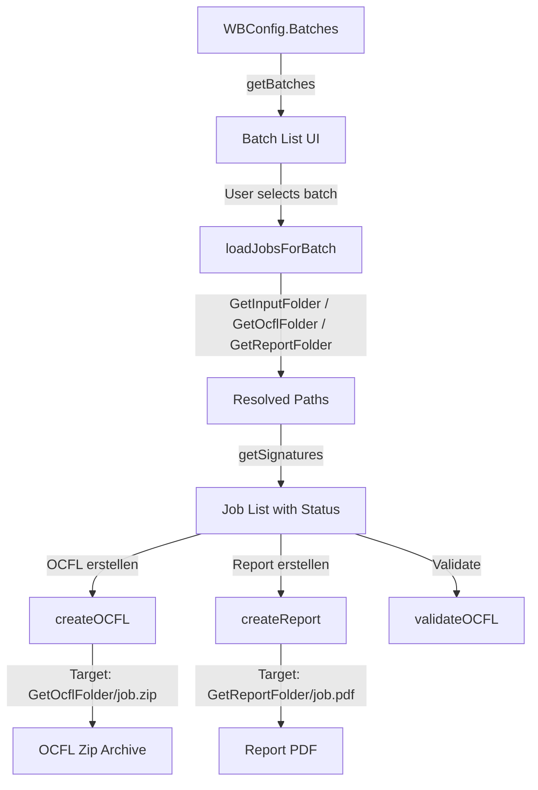

# Requirements

### Overview & Goals
To maximize operational efficiency, reduce user confusion, and prevent file collision errors across large data processing workloads, the directory layout must dynamically resolve batch-specific paths. Batch folders will be discovered under `WBConfig.Batches`, and individual workflow paths (`Input`, `Ocfl`, `Report`, `Error`, `Archived`) will substitute the dynamic placeholder `{batch}` with the respective batch folder name. If a target folder (e.g. `ocfl` or `report`) does not yet exist, it may only be automatically created if only the final path level is missing (i.e., its parent directory already exists).

### Scope
- **In Scope**:
  - Updating `WBConfig` to support helper methods for resolving paths with `{batch}` substitution.
  - Updating batch listing in `ui.go` to scan `conf.Batches`.
  - Updating job discovery in `job.go` to utilize batch-resolved incoming, OCFL, and report directories.
  - Implementing single-level target directory creation guard (`EnsureTargetDirectory`) so target folders are created only if their immediate parent exists.
  - Updating action runners (`createOCFL`, `createReport`, `validateOCFL`) in `actions.go` to output and validate files within batch-resolved target paths with target directory validation.
- **Out of Scope**:
  - Modifying external `gocfl` binary arguments or CLI contracts outside directory parameters.
  - Changing overall TUI layout themes or keybindings.

### User Stories
- As an archive operator, I want the workbench to automatically identify batch folders in `WBConfig.Batches` and inspect their `incoming/` directory so that incoming records are organized and immediately available for processing.
- As an archive operator, I want generated OCFL packages and verification reports to be placed into `{batch}/ocfl/` and `{batch}/report/` respectively so that all outputs are cleanly partitioned by batch without manual directory management.
- As an archive operator, I want target subdirectories (like `ocfl` or `report`) to be created automatically only when the batch folder already exists, preventing accidental creation of invalid deep directory hierarchies when a batch path is wrong.

### Functional Requirements
1. **Batch Discovery**: Discover all valid batch subdirectories located in `WBConfig.Batches` (or `WBConfig.Input` fallback if `Batches` is unset).
2. **Path Resolution Matrix**:
   - **With `{batch}` Placeholder**: Replace all occurrences of `{batch}` in `conf.Input`, `conf.Ocfl`, `conf.Report`, `conf.Error`, and `conf.Archived` with the selected batch folder name.
   - **Static Path (Without `{batch}`)**: If a path is configured without `{batch}`, use the configured static path directly as-is (e.g., a shared `conf.Ocfl = "/var/ocfl"` or `conf.Report = "/var/report"`).
   - **Unset/Empty Path**: If a path configuration is empty, default safely to `{Batches}/{batch}/<type>` (e.g. `incoming`, `ocfl`, `report`, `error`, `archived`).
3. **Artifact Location Consistency**:
   - `info.json`, `data/`, and `metadata/` must be read from the resolved incoming directory (`conf.GetInputFolder(batch)`).
   - OCFL container existence checks and creation targets must use the resolved OCFL directory (`conf.GetOcflFolder(batch)/<job>.zip`).
   - Report PDF existence checks and generation targets must use the resolved report directory (`conf.GetReportFolder(batch)/<job>.pdf`).
4. **Controlled Single-Level Directory Creation**:
   - When preparing target folders (e.g. `{batch}/ocfl` or `{batch}/report` or static target paths) for output generation, the target directory may be created if and only if only the last directory level is missing (i.e. the parent directory `filepath.Dir(targetDir)` already exists).
   - If more than the last level is missing (parent directory does not exist), directory creation must fail and report an error rather than creating arbitrary nested directories via recursive creation.

### Non-Functional Requirements
- **Reliability & Idempotency**: Resolving paths must be deterministic and safe against trailing slashes or varying OS path separators.
- **Performance**: Path resolution overhead must be negligible ($O(1)$ string replacement per batch selection).

# Technical Design

### Current Implementation
- `cmd/create_container/config.go`: Defines `WBConfig` with fields `Batches`, `Input`, `Ocfl`, `Report`, `Error`, `Archived`, and `Gocfl`.
- `cmd/create_container/ui.go`: `setupUI` currently attempts to read batches directly from `conf.Input` rather than `conf.Batches`. `loadJobsForBatch` joins `conf.Input` and `batchName` directly without placeholder replacement, and passes raw `conf.Ocfl` and `conf.Report` to `getSignatures`.
- `cmd/create_container/job.go`: `Job` struct does not record the batch identifier, making downstream actions dependent on global config paths without batch context.
- `cmd/create_container/actions.go`: `createOCFL`, `createReport`, and `validateOCFL` directly join `conf.Ocfl` or `conf.Report` with the job file name, which fails when those config paths contain `{batch}` templates.

### Key Decisions
1. **Helper Methods on `WBConfig`**:
   - Implement dedicated path resolver methods (`GetInputFolder`, `GetOcflFolder`, `GetReportFolder`, etc.) on `*WBConfig`.
   - *Rationale*: Centralizing path interpolation logic in `WBConfig` maximizes code reuse, testability, and maintainability while avoiding repeated inline string manipulation.
2. **Associating Batch Context in `Job`**:
   - Add a `batch string` field to `Job`.
   - *Rationale*: Retaining batch context in `Job` gives action handlers (`createOCFL`, `createReport`, `validateOCFL`) direct access to determine the exact destination paths without relying on global mutable state.
3. **Controlled Single-Level Directory Creation (`EnsureTargetDirectory`)**:
   - Create destination folders prior to executing `gocfl` commands only if the parent directory already exists (`os.Mkdir` after verifying parent `os.Stat`).
   - *Rationale*: Allows automatic creation of missing leaf folders (`ocfl`, `report`) within an existing batch while preventing accidental generation of corrupted deep path trees when a parent batch path is missing or invalid.

### Data Models / Contracts

#### `Job` struct (`cmd/create_container/job.go`)
```go
type Job struct {
	baseName       string // Base identifier / folder name of the job.
	batch          string // Enclosing batch directory name.
	infoFile       string // Path to the JSON file containing signature and title metadata.
	dataFolder     string // Path to the folder containing data payload files, if present.
	metadataFolder string // Path to the folder containing metadata files, if present.
	ocflFile       string // Path to the generated OCFL zip archive, if it exists.
	reportFile     string // Path to the generated PDF report, if it exists.
	signature      string // Unique identifier/signature for the job.
	title          string // Human-readable title for the job.
}
```

#### Directory Guard (`cmd/create_container/helper.go`)
```go
// EnsureTargetDirectory verifies that dir exists, or creates it if only the last path element is missing.
func EnsureTargetDirectory(dir string) error {
	fi, err := os.Stat(dir)
	if err == nil {
		if !fi.IsDir() {
			return fmt.Errorf("target path %s exists and is not a directory", dir)
		}
		return nil
	}
	if !os.IsNotExist(err) {
		return errors.Wrapf(err, "failed to stat directory %s", dir)
	}

	parent := filepath.Dir(filepath.Clean(dir))
	pFi, err := os.Stat(parent)
	if err != nil || !pFi.IsDir() {
		return fmt.Errorf("cannot create target directory %s: parent directory %s does not exist", dir, parent)
	}

	return os.Mkdir(dir, 0755)
}
```

#### Path Resolution Methods (`cmd/create_container/config.go`)
```go
func (c *WBConfig) GetInputFolder(batch string) string {
	if c.Input != "" {
		if strings.Contains(c.Input, "{batch}") {
			return filepath.Clean(strings.ReplaceAll(c.Input, "{batch}", batch))
		}
		return filepath.Clean(c.Input)
	}
	if c.Batches != "" {
		return filepath.Join(c.Batches, batch, "incoming")
	}
	return ""
}

func (c *WBConfig) GetOcflFolder(batch string) string {
	if c.Ocfl != "" {
		if strings.Contains(c.Ocfl, "{batch}") {
			return filepath.Clean(strings.ReplaceAll(c.Ocfl, "{batch}", batch))
		}
		return filepath.Clean(c.Ocfl)
	}
	if c.Batches != "" {
		return filepath.Join(c.Batches, batch, "ocfl")
	}
	return ""
}

func (c *WBConfig) GetReportFolder(batch string) string {
	if c.Report != "" {
		if strings.Contains(c.Report, "{batch}") {
			return filepath.Clean(strings.ReplaceAll(c.Report, "{batch}", batch))
		}
		return filepath.Clean(c.Report)
	}
	if c.Batches != "" {
		return filepath.Join(c.Batches, batch, "report")
	}
	return ""
}

func (c *WBConfig) GetErrorFolder(batch string) string {
	if c.Error != "" {
		if strings.Contains(c.Error, "{batch}") {
			return filepath.Clean(strings.ReplaceAll(c.Error, "{batch}", batch))
		}
		return filepath.Clean(c.Error)
	}
	if c.Batches != "" {
		return filepath.Join(c.Batches, batch, "error")
	}
	return ""
}

func (c *WBConfig) GetArchivedFolder(batch string) string {
	if c.Archived != "" {
		if strings.Contains(c.Archived, "{batch}") {
			return filepath.Clean(strings.ReplaceAll(c.Archived, "{batch}", batch))
		}
		return filepath.Clean(c.Archived)
	}
	if c.Batches != "" {
		return filepath.Join(c.Batches, batch, "archived")
	}
	return ""
}
```

### Components & Flow



### File Structure & Changes
- `cmd/create_container/config.go`: Add `GetInputFolder`, `GetOcflFolder`, `GetReportFolder`, `GetErrorFolder`, `GetArchivedFolder`.
- `cmd/create_container/helper.go`: Add `EnsureTargetDirectory` to check parent existence before creating leaf directories.
- `cmd/create_container/job.go`: Add `batch` field to `Job`; update `getSignatures` signature and assignment.
- `cmd/create_container/ui.go`: Use `conf.Batches` for `getBatches`; use `conf.Get...Folder(batchName)` in `loadJobsForBatch`.
- `cmd/create_container/actions.go`: Use `conf.GetOcflFolder(job.batch)` and `conf.GetReportFolder(job.batch)` with `EnsureTargetDirectory` checks in `createOCFL`, `createReport`, and `validateOCFL`.

# Testing

### Validation Approach
Verification focuses on deterministic directory template resolution, robust artifact existence checks across batch subfolders, and successful CLI command parameter construction.

### Key Scenarios
1. **Dynamic `{batch}` Template Resolution**:
   - `conf.Ocfl = "C:/data/{batch}/ocfl"`, `batch = "batch_01"`.
   - Expected outcome: `GetOcflFolder("batch_01")` returns `"C:/data/batch_01/ocfl"`.
2. **Static Configured Path Without `{batch}`**:
   - `conf.Ocfl = "C:/shared/ocfl"`, `conf.Report = "C:/shared/report"`, `batch = "batch_01"`.
   - Expected outcome: `GetOcflFolder("batch_01")` returns `"C:/shared/ocfl"`, `GetReportFolder("batch_01")` returns `"C:/shared/report"`.
3. **Fallback Resolution for Unset Paths**:
   - `conf.Batches = "C:/batches"`, `conf.Ocfl = ""`, `batch = "batch_01"`.
   - Expected outcome: `GetOcflFolder("batch_01")` defaults to `"C:/batches/batch_01/ocfl"`.
4. **Batch Listing and Job Discovery**:
   - `conf.Batches` pointing to a directory with multiple subfolders (e.g. `batch_01`, `batch_02`).
   - Expected outcome: TUI batch panel lists all subfolders discovered under `conf.Batches`, and selecting `batch_01` lists all jobs found inside its resolved input folder.
5. **Output Generation and Single-Level Directory Creation**:
   - Triggering "OCFL erstellen" or "Report erstellen" for a job in `batch_01`.
   - Expected outcome: Missing target leaf directories are created (if parent exists) and commands target the resolved destination paths.

### Edge Cases
- Missing `{batch}` token in configuration: Defaults safely to `{Batches}/{batch}/<type>`.
- Multi-level missing directory path: If `batch_01` itself does not exist, `EnsureTargetDirectory` fails and aborts before creating intermediate or corrupt folder structures.
- Target path exists as a regular file: Handled with a clear error indicating the target path is not a directory.
- Empty batch directories: Handled gracefully without crashes, clearing job lists cleanly.

# Delivery Steps

### ✓ Step 1: Update Path Resolution Helpers in WBConfig for Static, Templated, and Fallback Paths
`WBConfig` provides robust helper methods to resolve paths whether configured with `{batch}`, configured as static paths without `{batch}`, or falling back to default batch subfolders.

- Update helper methods on `WBConfig` in `cmd/create_container/config.go`: `GetInputFolder`, `GetOcflFolder`, `GetReportFolder`, `GetErrorFolder`, and `GetArchivedFolder`.
- If a path is configured and contains `{batch}`, substitute `{batch}` with the batch identifier.
- If a path is configured without `{batch}`, preserve and return the static configured path (`filepath.Clean`).
- If a path configuration is empty, default to constructing `{Batches}/{batch}/<type>` relative to `conf.Batches`.
- Ensure all resolved paths are normalized using `filepath.Clean`.

### ✓ Step 2: Update Unit Tests and Verify Path Scenarios
Unit tests cover static paths, `{batch}` templated paths, empty fallbacks, and directory creation guards.

- Update `TestWBConfigPathResolution` in `cmd/create_container/batch_test.go` to test:
  1. Templated paths with `{batch}` placeholder.
  2. Static paths without `{batch}` placeholder (e.g. `C:/shared/ocfl`).
  3. Fallback behavior when paths are empty.
- Run tests via `go test ./...` and verify clean build with `go build ./...`.