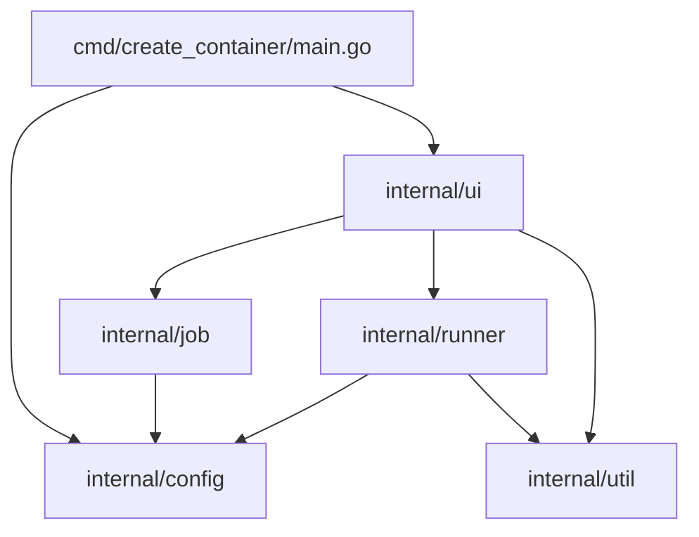

# Requirements

### Overview & Goals
The goal of this refactoring is to modularize the `create_container` application by breaking down its single-package structure into cohesive, reusable internal Go packages under `internal/` (`internal/config`, `internal/job`, `internal/runner`, `internal/ui`, `internal/util`), reducing coupling, increasing testability, and producing comprehensive, structured English documentation (`README.md`, `docs/ARCHITECTURE.md`, `docs/CONFIGURATION.md`).

### Scope
- **In Scope:**
  - Decomposing `cmd/create_container/` into dedicated internal packages:
    - `internal/config`: Configuration schema, path resolution with `{batch}` tokens, and TOML loading.
    - `internal/util`: Directory verification and TCP port allocation utilities.
    - `internal/job`: Data models (`Job`, `Info`) and filesystem scanning (`GetBatches`, `GetSignatures`).
    - `internal/runner`: Command building and execution wrappers for the `gocfl` toolchain (create, report, validate).
    - `internal/ui`: TUI components (`tview`), layout management, detail rendering, modal dialogs, and ANSI log streaming.
  - Refactoring `cmd/create_container/main.go` into a minimal CLI entry point.
  - Splitting and relocating existing unit tests (`batch_test.go`) into package-level test files (`internal/config/config_test.go`, `internal/job/job_test.go`, `internal/util/dir_test.go`).
  - Writing English documentation:
    - Root `README.md` (overview, quickstart, build instructions, keybindings).
    - `docs/ARCHITECTURE.md` (subsystem architecture, package interactions, workflow diagrams).
    - `docs/CONFIGURATION.md` (TOML format, placeholder rules, default search paths).
    - Go docstrings on all exported packages and functions.
- **Out of Scope:**
  - Changing functional behavior of the TUI, keybindings, or `gocfl` invocation logic.
  - Introducing new third-party dependencies outside the existing module dependencies.

### User Stories
- **As a developer**, I want `create_container` organized into clear, focused Go packages so that I can easily understand, maintain, test, and extend individual components without side effects.
- **As a developer**, I want clear English documentation and architectural diagrams so that I can configure, operate, and contribute to Workbench without guesswork.
- **As an archivist/operator**, I want consistent configuration rules and predictable command execution with real-time feedback during OCFL container creation and validation.

### Functional Requirements
- **Unchanged Runtime Behavior:** CLI flags (`-config`), startup banner display, batch and job navigation, detail pane rendering, modal command execution, and real-time log streaming must behave identically to the current implementation.
- **Clean Package APIs:** Each package must export only necessary structs and functions, keeping internal state encapsulated.
- **Complete Test Coverage:** All existing test cases in `batch_test.go` must be migrated to their respective package test suites and pass cleanly via `go test ./...`.

### Non-Functional Requirements
- **Go Idioms & Standards:** Code formatting strictly adhering to `go fmt` / `goimports` and standard Go package layout conventions.
- **Documentation Quality:** Clear, concise, idiomatic technical English across all markdown files and code comments.
- **Build Efficiency:** Clean dependency tree without cyclic imports and zero build warnings.

# Technical Design

### Current Implementation
Currently, all source files for `create_container` reside in `cmd/create_container/` under `package main`:
- `main.go`: CLI flag parsing, logger setup, application loop.
- `config.go`: `WBConfig` struct and `LoadConfig`.
- `job.go`: `Job` and `info` structs, `getBatches` and `getSignatures` scanning.
- `actions.go`: Modal dialogs and `gocfl` subcommands (`create`, `display`, `validate`).
- `helper.go`: `EnsureTargetDirectory` and `GetFreePort`.
- `ui.go`: TView flex layouts, keybindings, log streaming.
- `banner.go`: ASCII logo string.
- `batch_test.go`: Monolithic unit tests covering config, directory checks, and signatures.

### Key Decisions
1. **Internal Package Encapsulation (`internal/`)**:
   - *Decision:* Place reusable logic into `internal/` subpackages (`internal/config`, `internal/util`, `internal/job`, `internal/runner`, `internal/ui`).
   - *Rationale:* Protects internal APIs from unintentional external module imports while keeping code modular, loosely coupled, and independently testable.
2. **Separation of Command Runner from UI Modal**:
   - *Decision:* Separate `gocfl` command construction (`internal/runner`) from modal rendering and process output streaming (`internal/ui`).
   - *Rationale:* Allows command definitions to be tested and invoked independently of `tview` modal UI constructs.
3. **Dedicated Documentation Hierarchy (`docs/`)**:
   - *Decision:* Use `README.md` for fast onboarding/usage and create `docs/ARCHITECTURE.md` and `docs/CONFIGURATION.md` for in-depth technical documentation.
   - *Rationale:* Keeps the root README concise for users while giving developers exhaustive reference material.

### Proposed File Structure
```
workbench/
├── cmd/
│   └── create_container/
│       └── main.go                  # Lightweight CLI entry point
├── internal/
│   ├── config/
│   │   ├── config.go               # WBConfig, GOCFLConfig, LoadConfig, path resolution
│   │   └── config_test.go          # Config & path resolution unit tests
│   ├── job/
│   │   ├── job.go                  # Job & Info models
│   │   ├── scanner.go              # GetBatches & GetSignatures directory scanners
│   │   └── job_test.go             # Job discovery unit tests
│   ├── runner/
│   │   └── runner.go               # gocfl command builders (create, report, validate)
│   ├── ui/
│   │   ├── banner.go               # ASCII startup banner
│   │   ├── detail.go               # Job detail formatter
│   │   ├── modal.go                # Modal execution dialog & ANSI streaming
│   │   └── ui.go                   # TUI setup, layouts, key handling, log stream
│   └── util/
│       ├── dir.go                  # EnsureTargetDirectory
│       ├── dir_test.go             # Directory validation unit tests
│       └── port.go                 # GetFreePort TCP allocator
├── docs/
│   ├── ARCHITECTURE.md             # System design, package roles, Mermaid flow
│   └── CONFIGURATION.md            # TOML reference, placeholder expansion, fallbacks
├── config/
│   └── workbench.toml              # Sample configuration
├── go.mod
├── go.sum
└── README.md                       # Comprehensive English project overview
```

### Architecture Diagram



### Exported Data Models & Signatures

#### `internal/config`
```go
type GOCFLConfig struct {
    Config string `toml:"config"`
}

type WBConfig struct {
    Batches  string      `toml:"batches"`
    Input    string      `toml:"input"`
    Ocfl     string      `toml:"ocfl"`
    Report   string      `toml:"report"`
    Error    string      `toml:"error"`
    Archived string      `toml:"archived"`
    Gocfl    GOCFLConfig `toml:"gocfl"`
}

func LoadConfig(configPath string) (*WBConfig, error)
func (c *WBConfig) GetInputFolder(batch string) string
func (c *WBConfig) GetOcflFolder(batch string) string
func (c *WBConfig) GetReportFolder(batch string) string
func (c *WBConfig) GetErrorFolder(batch string) string
func (c *WBConfig) GetArchivedFolder(batch string) string
```

#### `internal/job`
```go
type Job struct {
    BaseName       string
    Batch          string
    InfoFile       string
    DataFolder     string
    MetadataFolder string
    OcflFile       string
    ReportFile     string
    Signature      string
    Title          string
}

type Info struct {
    Signature string `json:"signature"`
    Title     string `json:"title"`
}

func GetBatches(folder string) ([]string, error)
func GetSignatures(batchName, inputF, ocflF, reportF string, logger zerolog.Logger) ([]Job, error)
```

#### `internal/runner`
```go
func CreateOCFLCmd(conf *config.WBConfig, j job.Job) (*exec.Cmd, error)
func CreateReportCmd(conf *config.WBConfig, j job.Job, port int) (*exec.Cmd, error)
func ValidateOCFLCmd(conf *config.WBConfig, j job.Job) (*exec.Cmd, error)
```

#### `internal/util`
```go
func EnsureTargetDirectory(dir string) error
func GetFreePort() (int, error)
```

#### `internal/ui`
```go
func SetupUI(app *tview.Application, conf *config.WBConfig, logger zerolog.Logger, logReader io.Reader) (*tview.TextView, *tview.Pages)
func ShowDetail(j job.Job, target *tview.TextView)
func RunCommandInModal(app *tview.Application, pages *tview.Pages, title, startMsg string, cmd *exec.Cmd, onFinish func(exitCode int))
```

# Testing

### Validation Approach
Verification is performed through automated unit test execution across all new packages, static analysis / compilation of the `cmd/create_container` executable, and inspection of generated markdown documentation.

### Key Scenarios
1. **Compilation & Build:**
   - Execute `go build ./cmd/create_container` to ensure all package imports, signatures, and types resolve without error.
2. **Package Unit Tests:**
   - Execute `go test -v ./internal/...` to verify:
     - `internal/config`: Static and dynamic `{batch}` path token expansion and default fallbacks.
     - `internal/util`: Directory existence, creation of missing leaf directories, and missing parent error handling.
     - `internal/job`: Discovery of batches, parsing of `info.json` (subfolder and sibling), and detection of OCFL zip / PDF report artifacts.
3. **Documentation Quality & Links:**
   - Validate that `README.md`, `docs/ARCHITECTURE.md`, and `docs/CONFIGURATION.md` contain accurate code snippets, valid Mermaid markup, correct configuration keys, and functional relative cross-links.

### Edge Cases
- Empty or missing configuration parameters (verifying proper fallback behavior in `internal/config`).
- Malformed or missing `info.json` metadata during batch scanning (verifying warning logging in `internal/job`).
- Non-existent parent directory when ensuring target folders (verifying error handling in `internal/util`).

### Test Changes
- Migrate existing test functions from `cmd/create_container/batch_test.go` to:
  - `internal/config/config_test.go` (`TestWBConfigPathResolution`)
  - `internal/util/dir_test.go` (`TestEnsureTargetDirectory`)
  - `internal/job/job_test.go` (`TestGetSignaturesWithBatch`)

# Delivery Steps

### ✓ Step 1: Extract utility, config, and job packages to internal
The foundational utilities, configuration loaders, and domain job scanners are separated into clean, self-contained `internal/` packages with dedicated unit tests.

- Create `internal/util/dir.go` with `EnsureTargetDirectory` and `internal/util/port.go` with `GetFreePort`.
- Move utility unit tests to `internal/util/dir_test.go`.
- Create `internal/config/config.go` containing `WBConfig`, `GOCFLConfig`, `LoadConfig`, and folder path resolution helpers (`GetInputFolder`, `GetOcflFolder`, etc.).
- Move configuration unit tests from `cmd/create_container/batch_test.go` to `internal/config/config_test.go`.
- Create `internal/job/job.go` and `internal/job/scanner.go` containing the `Job` struct, `Info` metadata struct, `GetBatches`, and `GetSignatures`.
- Move job scanner tests to `internal/job/job_test.go`.

### ✓ Step 2: Extract runner and TUI packages to internal/runner and internal/ui
External command orchestration and the terminal user interface are decoupled into dedicated packages.

- Create `internal/runner/runner.go` encapsulating `gocfl` command construction for OCFL creation, report generation, and validation.
- Create `internal/ui/banner.go` containing the startup ASCII banner.
- Create `internal/ui/modal.go` containing `RunCommandInModal` for process streaming and keyboard interaction.
- Create `internal/ui/detail.go` containing `ShowDetail` for metadata formatting.
- Create `internal/ui/ui.go` containing `SetupUI` with layout definitions, list bindings, action button triggers, and log streaming.

### ✓ Step 3: Refactor main entry point and verify test suite
The CLI entry point `cmd/create_container/main.go` is streamlined to wire packages together, and all workspace tests pass.

- Refactor `cmd/create_container/main.go` to import `internal/config` and `internal/ui`, parse flags, initialize logger pipe streaming, and run the TUI app.
- Remove obsolete files in `cmd/create_container/` (`actions.go`, `banner.go`, `batch_test.go`, `config.go`, `helper.go`, `job.go`, `ui.go`).
- Run `go test ./...` and `go build ./cmd/create_container` to ensure full compilation and test coverage across all internal packages.

### ✓ Step 4: Author comprehensive English documentation
High-quality, comprehensive English documentation is created across root and modular doc files.

- Update `README.md` in English with project summary, features, prerequisites, quickstart, installation, and usage.
- Create `docs/ARCHITECTURE.md` with system design, package responsibilities, Mermaid interaction diagrams, and execution workflows.
- Create `docs/CONFIGURATION.md` detailing TOML parameters, placeholder resolution (`{batch}`), fallback behavior, and configuration discovery paths.
- Ensure all Go packages and exported identifiers contain clear, idiomatic English docstrings.