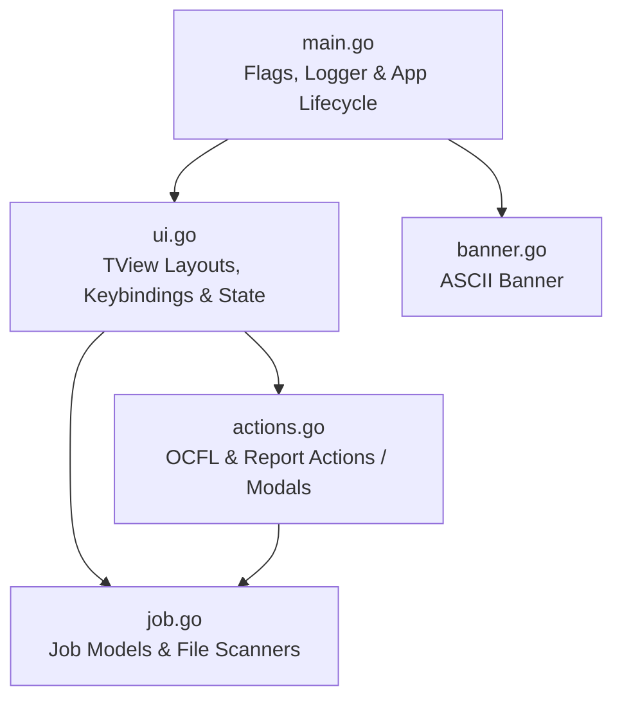

# Requirements

### Overview & Goals
Das Ziel dieser Umstrukturierung ist es, die monolithische `cmd/create_container/main.go` (derzeit ca. 290 Zeilen mit vermischten Zuständigkeiten) in modularisierte, klar abgegrenzte Quelldateien innerhalb des `main`-Pakets aufzuteilen. Dies maximiert die Übersichtlichkeit, erleichtert die Wartung und ermöglicht spätere Erweiterungen (z. B. der Report-Erstellung) mit minimalem kognitiven Aufwand.

### Scope
- **In Scope:**
  - Aufteilung der Logik in thematisch fokussierte Dateien im Verzeichnis `cmd/create_container/`.
  - Trennung von CLI-Initialisierung, UI-Konstruktion/State, Datenerfassung/Scanning, Prozessausführung (Actions) und statischen Assets (Banner).
  - Beibehaltung aller bestehenden Funktionen, Schnittstellen, CLI-Flags und TUI-Interaktionen ohne Verhaltensänderung.
- **Out of Scope:**
  - Funktionale Änderungen an der TUI oder den Prozessaufrufen.
  - Auslagerung in externe Bibliotheken außerhalb des `workbench`-Moduls (alle Dateien verbleiben im Package `main` von `create_container`, um unnötige Paketzyklen zu vermeiden).

### User Stories
- **Als Entwickler** möchte ich UI-Layout, Dateisystem-Scanning und Hintergrund-Jobs in getrennten Dateien vorfinden, um Änderungen schnell, sicher und ohne Seiteneffekte vornehmen zu können.
- **Als Entwickler** möchte ich einen schlanken Einstiegspunkt in `main.go` haben, der den Programmablauf auf einen Blick verständlich macht.

### Functional Requirements
1. **Identisches Verhalten:** Startparameter (`-input-folder`, `-ocfl-folder`, `-report-folder`), TUI-Layout (Batches, Jobs, Detail, Logs, Banner) und Tasten-Navigation (Tab, Backtab, Pfeiltasten) funktionieren wie gewohnt.
2. **Kompilierbarkeit:** Das Programm baut wie zuvor mit `go build ./cmd/create_container` bzw. `go run ./cmd/create_container`.
3. **Klare Verantwortlichkeiten:** Jede Datei übernimmt eine eindeutige Rolle (Einstiegspunkt, UI, Domäne/Scanning, Aktionen, Assets).

### Non-Functional Requirements
- **Wartbarkeit:** Reduzierung der Dateigrößen auf fokussierte Einheiten (< 100 Zeilen pro Datei).
- **Go-Konventionen:** Einhaltung der standardmäßigen Go-Codeformatierung (`go fmt`) und Idiome für Multi-File-`package main`.

# Technical Design

### Current Implementation
Aktuell enthält `cmd/create_container/main.go` sämtliche Komponenten in einer einzigen Datei:
- CLI-Flags und ASCII-Banner-Konstante.
- Datenstrukturen: `Job`, `info`.
- Dateisystem-Scanning: `getBatches`, `getSignatures`.
- Prozessausführung & Modals: `createOCFL`, `createReport`.
- UI-Rendering & Layout: `showDetail`, TView-Initialisierung, Listen, Flexbox-Hierarchie, Tastatur-Event-Handler und Log-Piping.

### Key Decisions
1. **Dateiaufteilung innerhalb von `package main`**:
   - *Entscheidung:* Alle aufgeteilten Dateien bleiben im selben Paket `main` (`cmd/create_container/`).
   - *Rationale:* Dadurch können alle Typen und Funktionen paketintern ohne überflüssigen Boilerplate, Interfaces oder zyklische Abhängigkeiten direkt interagieren, während die Dateiübersichtlichkeit maximiert wird.
2. **Strukturierte Trennung nach Schichten**:
   - `main.go`: Startpunkt, Flag-Parsing, Initialisierung von Logger und App.
   - `job.go`: Datenmodelle (`Job`, `info`) und Dateisystem-Erkennung (`getBatches`, `getSignatures`).
   - `ui.go`: TView-Komponenten, Layout, Detailanzeige (`showDetail`), Keybindings und UI-State-Helper.
   - `actions.go`: Ausführungs-Logik (`createOCFL`, `createReport`) und modale Dialoge.
   - `banner.go`: Das ASCII-Banner als isolierte Konstante.

### Proposed File Structure
```
cmd/create_container/
├── actions.go    # createOCFL, createReport, Subprozess-Handling & Modals
├── banner.go     # ASCII-Banner Konstante
├── job.go        # Job/info Structs, getBatches, getSignatures (Dateisystem/JSON)
├── main.go       # Einstiegspunkt, Flag-Parsing, Logging-Setup, app.Run()
└── ui.go         # TView Setup, Layout-Flex, Key-Navigation, showDetail, State-Binding
```

### Component Architecture & Interactions



### Details of Changes per File

1. **`cmd/create_container/banner.go`**
   - Enthält die `banner`-String-Konstante.

2. **`cmd/create_container/job.go`**
   - Structs: `Job`, `info`.
   - Funktionen: `getBatches(folder string) ([]string, error)`, `getSignatures(inputF, ocflF, reportF string, logger zerolog.Logger) ([]Job, error)`.

3. **`cmd/create_container/actions.go`**
   - Funktionen: `createOCFL(app *tview.Application, pages *tview.Pages, job Job, onFinish func())`, `createReport(app *tview.Application, pages *tview.Pages, job Job, onFinish func())`.

4. **`cmd/create_container/ui.go`**
   - Hilfsfunktion `showDetail(job Job, target *tview.TextView)`.
   - Setup der Ansichten (`batchList`, `jobList`, `detailView`, `buttonFlex`, `logView`, `pages`).
   - UI-State und Event-Handler (`loadJobsForBatch`, `refreshCurrentBatch`, `updateDetailAndActions`).
   - Input-Capture-Handler (`Tab`, `Backtab`, `KeyLeft`, `KeyRight`).

5. **`cmd/create_container/main.go`**
   - Deklaration der CLI-Flags (`inputFolder`, `ocflFolder`, `reportFolder`).
   - Logger-Erstellung mit Pipe-Umleitung.
   - Aufruf des UI-Setups und Start von `app.Run()`.

# Testing

### Validation Approach
Da es sich um ein reines Refactoring handelt, wird die Korrektheit durch statische Analyse, Kompilierung und funktionale Abnahmetests verifiziert.

### Key Scenarios
1. **Build-Integrität:**
   - Ausführen von `go build ./cmd/create_container/...` stellt sicher, dass alle Symbole, Imports und Typen über die Dateigrenzen hinweg fehlerfrei aufgelöst werden.
2. **Flag-Parsing & CLI-Aufruf:**
   - Starten mit `-input-folder`, `-ocfl-folder`, `-report-folder` und Prüfung, ob Pfade korrekt an die Ladefunktionen weitergegeben werden.
3. **TUI-Rendering & Interaktion:**
   - Anzeige des Banner-Screens für 2 Sekunden, gefolgt vom Wechsel in die Hauptansicht.
   - Batch-Liste lädt Einträge, Job-Liste synchronisiert sich entsprechend.
   - Detail-Ansicht formatiert die Metadaten wie bisher.
   - Tastaturnavigation (`Tab`, `Backtab`, Pfeiltasten) wechselt zuverlässig den Fokus.
4. **Aktionsausführung:**
   - Klick/Auswahl von "OCFL erstellen" öffnet das Modal, führt den Befehl aus und schließt sich auf Tastendruck.

### Test Changes
- Keine Modifikation externer Test-Suiten erforderlich.
- Sicherstellung sauberer `go fmt`-Formatierung aller neu erstellten Dateien.

# Delivery Steps

### ✓ Step 1: Domänenmodelle, Batch-Erkennung und Banner auslagern
Domain-Modelle (`Job`, `info`), Datei- und Batch-Scanning (`getBatches`, `getSignatures`) sowie der ASCII-Banner sind in eigenständige Dateien ausgelagert.

- Erstellung von `cmd/create_container/banner.go` zur Auslagerung der ASCII-Art-Konstante `banner`.
- Erstellung von `cmd/create_container/job.go` mit den Datenstrukturen `Job` und `info`.
- Verschieben der Dateisystem- und Scan-Logik (`getBatches` und `getSignatures`) nach `job.go`.
- Bereinigung der nicht mehr benötigten Typen und Hilfsfunktionen aus `main.go`.

### ✓ Step 2: Prozessausführung und Modaldialoge in actions.go kapseln
Die Ausführungslogik für Hintergrundbefehle und TView-Modalfenster (`createOCFL`, `createReport`) ist in `actions.go` gekapselt.

- Erstellung von `cmd/create_container/actions.go`.
- Verschieben von `createOCFL` (Modal-Dialog, Prozessausführung via `exec.Command`, ANSI-Streaming und Tastatur-Handler) in `actions.go`.
- Verschieben des Funktionsrumpfs `createReport` in `actions.go`.
- Kapselung von Hilfsfunktionen für asynchrone Prozess-Modals, sodass UI und Prozesslogik sauber getrennt sind.

### ✓ Step 3: TUI-Layout, State und Navigation nach ui.go überführen
Die UI-Komponenten, das Layouting, die Tastaturnavigation und die Detailanzeige sind in `ui.go` organisiert und `main.go` dient rein als schlanker Einstiegspunkt.

- Erstellung von `cmd/create_container/ui.go` für TView-Initialisierung, Flex-Layouts (`upperFlex`, `detailFlex`, `logFlex`), Keybindings (`Tab`, `Backtab`, Pfeiltasten) und die Detaildarstellung (`showDetail`).
- Strukturierung des UI-Zustands (aktuelle Jobs, Event-Handler wie `loadJobsForBatch`, `updateDetailAndActions`, `refreshCurrentBatch`).
- Refactoring von `cmd/create_container/main.go` auf den minimalen Einstiegspunkt (CLI-Flag-Parsing, Logger-Pipe-Setup, Start der TUI-Applikation).

### ✓ Step 4: Kompilierung und Funktionsvalidierung durchführen
Das Gesamtpaket kompiliert fehlerfrei, ist formatiert und verhält sich identisch zum monolithischen Zustand.

- Prüfung der Kompilierung mit `go build ./cmd/create_container/...`.
- Formatierung aller Go-Dateien mit `go fmt ./...`.
- Funktionsprüfung von Flag-Parsing, TUI-Ansichten, Tastatursteuerung und Log-Streaming.