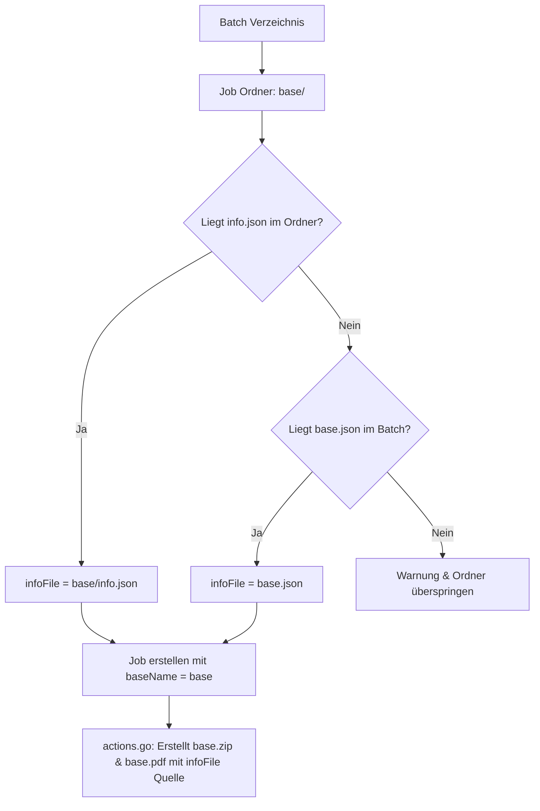

# Requirements

### Overview & Goals
Bisher erwartete `create_container`, dass die Metadaten-JSON-Datei für einen Job auf Batch-Ebene neben dem Job-Ordner liegt (z. B. `input/<batch>/<job>.json` passend zum Ordner `input/<batch>/<job>/`).
Neu soll die Metadaten-Datei optional auch direkt im jeweiligen Job-Ordner als `info.json` liegen können (z. B. `input/<batch>/<job>/info.json`).
Ziel ist es, `create_container` so anzupassen, dass beide Varianten nahtlos und abwärtskompatibel unterstützt werden.

### Scope
- **In Scope:**
  - Erkennung der Metadaten-Datei sowohl als `<job>/info.json` (im Ordner) als auch als `<job>.json` (neben dem Ordner).
  - Saubere Entkopplung des Job-/Container-Namens (`baseName`) vom Dateinamen des `infoFile`, damit OCFL-Zip- und Report-PDF-Dateinamen nicht fälschlicherweise `info.zip`/`info.pdf` heißen.
  - Beibehaltung der bestehenden UI-Darstellung und Argumentübergabe an externe Tools (`gocfl`).
- **Out of Scope:**
  - Änderungen am Format oder Inhalt der JSON-Datei (`signature`, `title`).
  - Änderungen an der TUI-Struktur oder den `gocfl`-Befehlsparametern.

### User Stories
- **Als Benutzer** möchte ich Batch-Verzeichnisse verarbeiten können, bei denen die Metadaten-Datei direkt im Job-Ordner unter dem Namen `info.json` liegt.
- **Als Benutzer** möchte ich weiterhin bestehende Batch-Verzeichnisse mit `<job>.json` neben dem Ordner verarbeiten können, ohne Daten umstrukturieren zu müssen.

### Functional Requirements
1. **Duale Erkennung in `getSignatures`:**
   - Für jeden Unterordner `<base>` im Batch-Verzeichnis wird geprüft:
     1. Existiert `<inputF>/<base>/info.json`? Falls ja, wird diese als `infoFile` verwendet.
     2. Falls nein, existiert `<inputF>/<base>.json`? Falls ja, wird diese als `infoFile` verwendet.
     3. Falls keines von beiden existiert, wird der Ordner mit einer Warnung übersprungen.
2. **Korrektes Naming von OCFL & Report:**
   - Der Dateiname für das OCFL-Archiv (`<base>.zip`) und den Report (`<base>.pdf`) muss stets auf dem Ordnernamen `<base>` basieren – unabhängig davon, ob die Datei `info.json` oder `<base>.json` heißt.
3. **Detailanzeige:**
   - `showDetail` zeigt weiterhin den tatsächlichen Pfad zur verwendeten `infoFile` an.

### Non-Functional Requirements
- **Abwärtskompatibilität:** Bestehende Verzeichnisstrukturen funktionieren ohne Anpassungen weiter.
- **Robustheit:** Fehlende oder ungültige JSON-Dateien führen wie bisher zu aussagekräftigen Log-Meldungen und bringen die Anwendung nicht zum Absturz.

# Technical Design

### Current Implementation
In `cmd/create_container/job.go` sucht `getSignatures` alle `.json`-Dateien auf Batch-Ebene und prüft anschließend, ob ein passender gleichnamiger Ordner existiert:
```go
for _, jsonfile := range jsons {
    base := jsonfile[0 : len(jsonfile)-5]
    if !slices.Contains(folders, base) { ... }
    ...
    job := Job{
        signature: i.Signature,
        title:     i.Title,
        infoFile:  path.Join(inputF, jsonfile),
    }
}
```
In `cmd/create_container/actions.go` wird der Name für Zip- und PDF-Dateien über `filepath.Base(job.infoFile)` abgeleitet:
```go
zipName := fmt.Sprintf("%s.zip", strings.TrimSuffix(filepath.Base(job.infoFile), ".json"))
```
Wenn `infoFile` nun `info.json` heißt, würde daraus fälschlicherweise `info.zip` und `info.pdf` generiert.

### Key Decisions
1. **Ordner-zentriertes Scanning in `getSignatures`**:
   - *Entscheidung:* Statt über `.json`-Dateien zu iterieren, wird primär über alle Unterverzeichnisse (`folders`) iteriert und für jedes Verzeichnis geprüft, ob entweder `<folder>/info.json` oder `<folder>.json` existiert.
   - *Rationale:* Der Job-Ordner ist die primäre Entität, die Daten und Metadaten bündelt. Dies ermöglicht eine priorisierte Suche (`<folder>/info.json` vor `<folder>.json`) ohne Doppeleinträge.
2. **Explizites `baseName`-Feld im `Job`-Struct**:
   - *Entscheidung:* `Job` erhält ein Feld `baseName string` (bzw. `base string`), das den Ordnernamen des Jobs speichert.
   - *Rationale:* Entkoppelt die Generierung von Artefakt-Namen (`.zip`, `.pdf`) in `actions.go` vollständig vom konkreten Pfad oder Namen der Metadaten-Datei.

### Proposed Changes

#### 1. `cmd/create_container/job.go`
- Erweitere `Job`:
  ```go
  type Job struct {
      baseName       string // Base identifier / folder name of the job.
      infoFile       string // Path to the JSON file containing signature and title metadata.
      dataFolder     string // Path to the folder containing data payload files, if present.
      metadataFolder string // Path to the folder containing metadata files, if present.
      ocflFile       string // Path to the generated OCFL zip archive, if it exists.
      reportFile     string // Path to the generated PDF report, if it exists.
      signature      string // Unique identifier/signature for the job.
      title          string // Human-readable title for the job.
  }
  ```
- Passe `getSignatures` an:
  - Iteriere über alle Unterordner `base` im Batch-Pfad.
  - Prüfe `path.Join(inputF, base, "info.json")` -> falls vorhanden, nutze diese Datei.
  - Falls nicht vorhanden, prüfe `path.Join(inputF, base+".json")` -> falls vorhanden, nutze diese Datei.
  - Wenn gefunden: Parse JSON (`signature`, `title`), setze `job.baseName = base`, `job.infoFile = resolvedPath`.
  - Prüfe Status von `dataFolder`, `metadataFolder`, `reportFile` (`<reportF>/<base>.pdf`) und `ocflFile` (`<ocflF>/<base>.zip`).

#### 2. `cmd/create_container/actions.go`
- In `createOCFL` und `createReport`:
  - Ersetze `strings.TrimSuffix(filepath.Base(job.infoFile), ".json")` durch `job.baseName`:
    ```go
    zipName := fmt.Sprintf("%s.zip", job.baseName)
    pdfName := fmt.Sprintf("%s.pdf", job.baseName)
    ```
  - Der Parameter `--ext-NNNN-metafile-source job.infoFile` bleibt unverändert, damit `gocfl` den korrekten Pfad zur `info.json` bzw. `<base>.json` erhält.

### Architecture Diagram



### Affected Files
- `cmd/create_container/job.go`
- `cmd/create_container/actions.go`

# Testing

### Validation Approach
Die Anpassungen werden durch statische Code-Inspektion, Kompilierung und gezielte Szenario-Prüfungen validiert.

### Key Scenarios
1. **Variante 1 (Klassisch): Sibling JSON**
   - Ordner `batch1/item1/` mit Metadaten `batch1/item1.json`.
   - `Job` wird erkannt, `infoFile` verweist auf `batch1/item1.json`, OCFL-Zieldatei ist `item1.zip`, Report-Zieldatei ist `item1.pdf`.
2. **Variante 2 (Neu): `info.json` im Ordner**
   - Ordner `batch1/item2/` mit Metadaten `batch1/item2/info.json`.
   - `Job` wird erkannt, `infoFile` verweist auf `batch1/item2/info.json`, OCFL-Zieldatei ist `item2.zip`, Report-Zieldatei ist `item2.pdf`.
3. **Mischbetrieb im selben Batch**
   - Batch enthält gleichzeitig Jobs mit `info.json` im Ordner und Jobs mit externer `<job>.json`.
   - Beide Jobs werden korrekt in der Job-Liste angezeigt und mit den jeweiligen Pfaden verarbeitet.
4. **Ordner ohne Metadaten**
   - Ordner `batch1/unrelated/` ohne `info.json` und ohne `unrelated.json`.
   - Logger warnt und überspringt den Ordner sicher ohne Panic/Fehlerabbruch.

### Edge Cases
- **Ungültiges JSON**: Beschädigte `info.json` oder `<base>.json` wird protokolliert und der betroffene Job übersprungen.
- **Gleichzeitiges Vorhandensein**: Wenn sowohl `info.json` im Ordner als auch `<base>.json` existieren, wird `info.json` bevorzugt.

# Delivery Steps

### ✓ Step 1: Extend Job struct and update metadata scanning in job.go
Update the Job model and directory scanning in `cmd/create_container/job.go` to support both metadata file locations.

- Add a `baseName` field to `Job` to reliably identify the job/folder name independently of `infoFile`'s filename.
- Refactor `getSignatures` to iterate through folder entries and check for the metadata file in order:
  1. Inside the job directory as `info.json` (`<inputF>/<base>/info.json`)
  2. In the batch directory as `<base>.json` (`<inputF>/<base>.json`)
- Read and parse the detected JSON file into `info`, assigning the exact resolved file path to `job.infoFile`.
- Keep scanning and assignment of `dataFolder`, `metadataFolder`, `reportFile`, and `ocflFile` based on `base`.

### ✓ Step 2: Update artifact filename resolution in actions.go
Fix container and report file naming in `cmd/create_container/actions.go` to use the job's base name.

- In `createOCFL`, derive `zipName` from `job.baseName` (e.g. `fmt.Sprintf("%s.zip", job.baseName)`) instead of trimming suffix from `job.infoFile`.
- In `createReport`, derive `zipName` and `pdfName` from `job.baseName`.
- Retain `job.infoFile` for the `--ext-NNNN-metafile-source` argument to pass the actual metadata file path to gocfl.

### ✓ Step 3: Verify compilation and linting
Validate that the project builds cleanly and both info file variants operate correctly.

- Build the project using `go build ./cmd/create_container`.
- Ensure code adheres to standard Go conventions and passes inspections without errors or warnings.