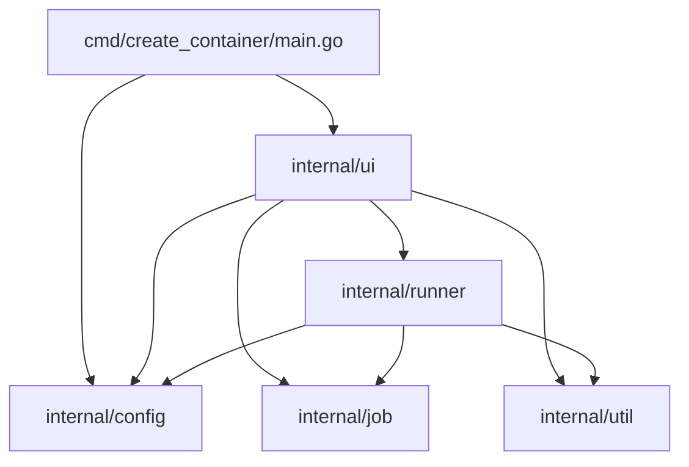
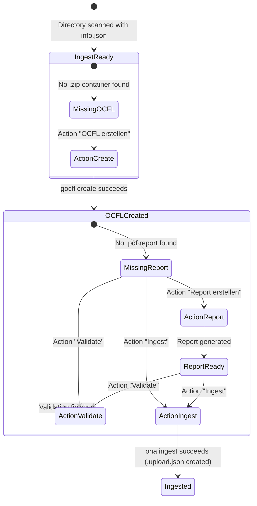

# Workbench Architecture

This document describes the software architecture, package hierarchy, data flows, and design principles of the `create_container` application within the Workbench suite.

---

### System Overview

`create_container` is a terminal-based workbench utility written in Go for managing digital archiving workflows. It scans batch directories for ingest items ("Jobs"), parses item-level metadata, and coordinates the packaging and validation of Oxford Common File Layout (OCFL) containers using the `gocfl` CLI toolchain.

The application follows a modular internal package architecture under `internal/`, separating domain scanning, configuration management, subprocess orchestration, and the Terminal User Interface (TUI).

---

### Component Architecture

---

### Package Responsibilities

| Package | Path | Responsibility |
| :--- | :--- | :--- |
| **CLI Entry Point** | `cmd/create_container/main.go` | Parses CLI flags, initializes configuration, creates log streaming pipe, and runs the TUI event loop. |
| **Config** | `internal/config` | Loads TOML configurations, discovers default config file locations, and resolves batch-specific dynamic directory paths (`{batch}`). |
| **Job** | `internal/job` | Defines `Job` and `Info` data structures and scans the filesystem to discover batches, jobs, and associated artifacts (`info.json`, `.zip`, `.pdf`). |
| **Runner** | `internal/runner` | Constructs `exec.Cmd` instances for `gocfl` CLI invocations (`create`, `display` / report generation, `validate`) and `ona` CLI invocations (`ingest`), as well as recording upload timestamps (`.upload.json`). |
| **UI** | `internal/ui` | Manages the terminal user interface (`tview`), layout splits (Batches, Jobs, Details, Actions, Logs), keyboard navigation, and real-time process output streaming modals. |
| **Util** | `internal/util` | General-purpose helpers, including directory existence validation (`EnsureTargetDirectory`) and dynamic TCP port allocation (`GetFreePort`). |

---

### Archival Workflow & State Transitions

Each job inside a batch transitions through lifecycle states depending on the presence of OCFL zip files and validation reports:

1. **Ingest Discovery:** The scanner identifies jobs containing `info.json` or `<folder_name>.json` within the input directory.
2. **OCFL Creation:** If no `.zip` file exists in the target OCFL directory, the UI offers **OCFL erstellen**. Running this invokes `gocfl create` with metadata and content folder parameters.
3. **Report Generation:** Once the `.zip` archive exists, if no corresponding `.pdf` report is found, the UI enables **Report erstellen**. Running this allocates an ephemeral TCP port and invokes `gocfl display --display-fullreport ...`.
4. **Validation:** For any existing `.zip` container, the **Validate** button allows operators to verify checksums and OCFL compliance via `gocfl validate`.
5. **Ingest:** For any existing `.zip` container, the **Ingest** button allows operators to send the container to archival storage via `ona ingest`. Upon successful execution, a `.upload.json` file is generated containing the upload timestamp.

---

### Concurrency and Real-Time Streaming

The application utilizes Go goroutines and channel/pipe abstractions to ensure smooth UI responsiveness:

- **Log Streaming:** Application logs produced via `zerolog` are written to an `os.Pipe`. A background goroutine reads line-by-line and renders formatted ANSI colored log entries into the bottom `Logs` pane using `tview.ANSIWriter`.
- **Modal Command Execution:** When triggering an action, `RunCommandInModal` launches `gocfl` as an asynchronous subprocess. Both `stdout` and `stderr` are streamed in real time to a scrollable modal dialog, allowing operators to monitor packaging progress without freezing the UI.
